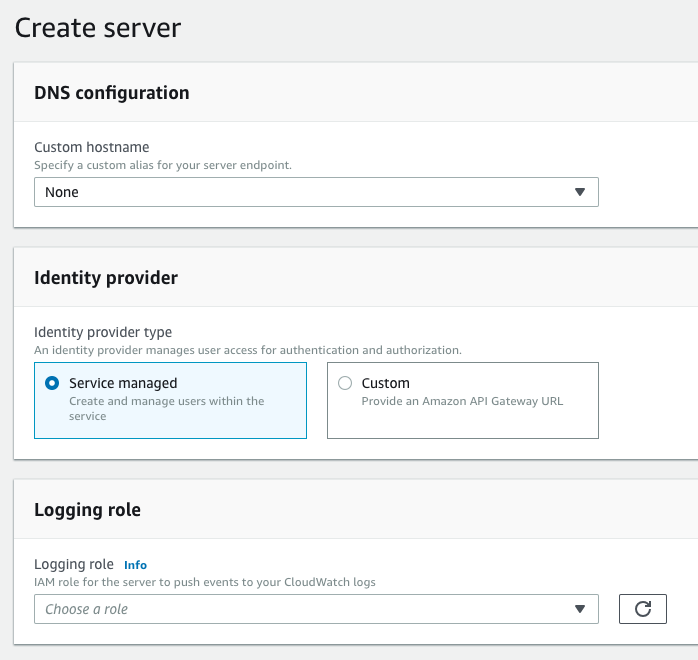
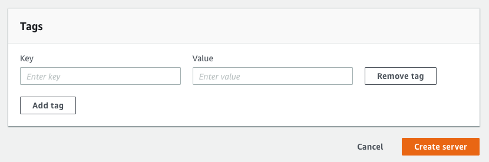
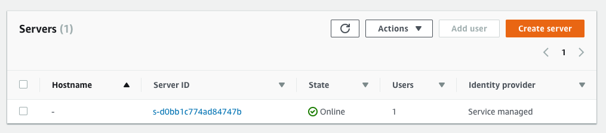

 
 
## AWS Transfer for SFTP 출시
[AWS Transfer for SFTP](http://console.aws.amazon.com/transfer/) 
AWS Transfer for SFTP가 출시 되었다. 주위 사람들은 아직도 AWS에 SFTP가 없었냐는 말을 한다. 
SFTP 있었지. EC2 Instance에 FTP를 설치하고 S3스토리지를 붙여서 Filezila로 접속해서 쓰면 됐다. 
하지만 이것저것 여러개 건드릴 필요 없이 AWS에서 서비스로 제공해 준다니 얼마나 좋나. 
당연히 장애도 안나겠지 ??? ~~저번주에 장애가 아주그냥~~  
새로운 서비스가 나왔으니 당연히 누구보다 빠르게 남들과는 다르게 신규 서비스를 이용해 보자. 

~~==**IAM**==을 먼저 학습하지 않으면 겁나 빡칠 수 있으니 선행 학습을 하고 오자~~

삽질 하지 않도록 최대한 쉬운 방법을 기술할 예정이니 IAM은 건너 뛰고 당장 만들어 보자

[AWS IAM](https://docs.aws.amazon.com/ko_kr/IAM/latest/UserGuide/introduction.html) 

## AWS Transfer for SFTP 설정
### How it works
**한글 문서**는 없으니 영문을 먼저 살펴보자

1. Map your hostname (호스트 네임을 매핑 하고)
 - Associate your hostname with the server endpoint (호스트 이름을 서버 엔드 포인트와 연관 시키십시오.)
2. Set up your users (사용자 설정)
 - Select your identity provider to set up your users’ access to your endpoint(ID 공급자를 선택하여 사용자의 끝점에 대한 액세스 권한을 설정합니다.)
3. Select your S3 bucket (버킷 선택)
 - Assign IAM role(s) to access your S3 bucket(s) for storing data transferred over SFTP (SFTP를 통해 전송 된 데이터를 저장하기위한 S3 버킷에 액세스하기위한 IAM 역할 할당)

3줄이 끝이다. 와~ 진짜 쉽구나!! 개꿀~ 
인줄 알았는데 이제 하다보면 구린 기운이 올라온다.
자 그지 같음은 내가 다 겪었으니 이글을 보시는 분은 찬찬히 따라해 봅시다.
### Create Server

- Create server를 선택 한다.

- DNS configuration 부분은 [**None**] (DNS연결하려면 해도 된다.)
- 모든 옵션은 디폴트로 쉬운 정책이기 떄문에 딱보면 안다. (~~모르겠으면 리플남기세요~~)
- Create server 눌러 서버 생성 시작!!

- 잠깐 기다리면 [**state**]가 Online으로 바뀐다,
- 이렇게 쉽게 서버가 만들어졌다.
- Server ID를 선택하여 SFTP에 사용할 유저를 만들러 가자.

### 2부에서 계속 ###

